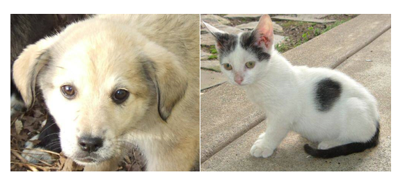
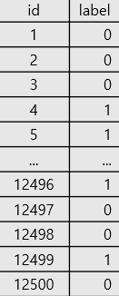
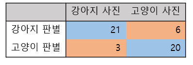
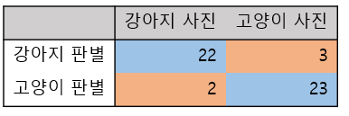

# 개와 고양이를 CNN으로 구별하기

### cat and dog 구분 선정 이유

* 학부생 미팅을 바탕으로 할 수 있는 것을 하려고 함

* 클래스를 2개로 나누는 과제로 단순하지만 다른 사람이 만든 코드를 잘 이해할 것이라 기대

* kaggle 사이트를 주로 사용하여 익숙해지는 계기가 될 것이라 기대

### 순서
* GOOD (목표: 80%~)
외부의 힘을 빌리지 않고 배운 개념을 바탕으로 코드를 직접 작성
CNN를 이용하여 모델을 이끌어냄

* BETTER (90%~)
직접 만든 코드를 인터넷을 참고하여 수정, 정확도 향상
CNN중에서 잘 만들어진 모델을 찾아보고 분석

* BEST (95%~)
가장 높은 정확도를 가진 코드를 그대로 들고와서 실행
어떤 모델을 썼는지, 어떻게 작동을 하는지 분석

### 데이터셋

출처 : https://www.kaggle.com/c/dogs-vs-cats

* Train Data
각각 12500개의 강아지, 고양이 사진

* Test Data
12500개의 강아지 또는 고양이 사진



### 사용환경
* 하드웨어
CPU : i5-7500
GPU : GTX 1050ti (CUDA)
RAM : 16GB

* 소프트웨어
Pycharm with Anaconda

* Tensorflow 2.0.0-beta1, keras
* Numpy, OpenCV, matplotlib
등등 여러가지 라이브러리

아래는 코드에 대한 이야기입니다.

```python

# 필요한 라이브러리를 불러옵니다.
import numpy as np
from tensorflow.keras import layers, models
import matplotlib.pyplot as plt
import cv2 # 그림 전처리를 위해 사용

#%%
#그림이 불러와지는지 랜덤으로 불러봅니다.
import random
testImg = "Dataset/train"+random.choice(['cat','dog'])+   "."+str(random.randint(0, 12500))+".jpg"
testImg = cv2.imread(testImg)
plt.imshow(testImg) # 그림 잘 나오는지 확인

```

```python
# 데이터 tensorflow를 하기 위해 한 array에 집어넣습니다.
# 필요할 경우 이미지 전처리를 할 수 있습니다
train_data = []
train_label = []
for i in ['dog', 'cat']:
    for j in range(12500):
        tmp = cv2.imread("Dataset/train/"+i+"."+str(j)+".jpg")
        tmp = cv2.resize(tmp, (64, 64))
        train_data.append(tmp)

train_label.append(0 if i == "dog" else 1)
train_data = np.array(train_data)
train_label = np.array(train_label)
train_data = train_data / 255.0

print(train_data.shape)
print(train_label.shape)

```

```python
#모델을 선언합니다.
model = models.Sequential() model.add(layers.Conv2D(64, (3, 3), activation='relu', input_shape=(64, 64, 3)))
model.add(layers.MaxPooling2D((2, 2)))
model.add(layers.Conv2D(128, (3, 3), activation='relu'))
model.add(layers.MaxPooling2D((2, 2)))
model.add(layers.Conv2D(128, (3, 3), activation='relu'))
model.add(layers.Flatten())
model.add(layers.Dense(32, activation = 'relu'))
model.add(layers.Dense(2, activation = 'softmax'))
model.compile(optimizer='adam', loss='sparse_categorical_crossentropy', metrics=['accuracy'])
model.summary()
```

```python
# CNN 모델을 tensorflow를 이용하여 학습합니다.
model.fit(trin_data, train_label, epoch = 5)
```

```python
# kaggle에 csv파일을 업로드하기 위해 라이브러리를 불러옵니다.

import pandas as pdsubmission = pd.read_csv("Dataset/sampleSubmission.csv", index_col='id')

#%%
# 테스트 셋 사진을 가져와 판별하게 합니다.

for i in range(1, 12501):
      animal = cv2.imread('Dataset/test1/'+str(i)+'.jpg')
          animal = cv2.resize(animal, (64, 64))
          animal = animal.reshape(1, 64,64, 3)
          predict = model.predict(animal)
          if predict[0][0] < predict[0][1]: #개     
          submission['label'][i-1] = 1
#%%
submission

#%%
# 테스트 셋을 판별해보고 이를 kaggle로 업로드합니다.

submission.to_csv("sampleSubmission2.csv", ',')

```
그러면 다음과 같은 csv 파일을 얻을 수 있습니다.


이 테스트 셋을 검증한 결과 정확도가 82%정도 나왔습니다.


### BETTER
더 나은 모델을 위해서 일부를 다음과 같이 수정할 수 있습니다.

```python
#%%
# 다른 사람이 만든 모델
model = models.Sequential()
model.add(layers.Conv2D(32, (3, 3), activation='relu', input_shape=(64, 64, 3)))
model.add(layers.BatchNormalization())
model.add(layers.MaxPooling2D(pool_size=(2, 2)))
model.add(layers.Dropout(0.25))

model.add(layers.Conv2D(64, (3, 3), activation='relu'))
model.add(layers.BatchNormalization())
model.add(layers.MaxPooling2D(pool_size=(2, 2)))
model.add(layers.Dropout(0.25))

model.add(layers.Conv2D(128, (3, 3), activation='relu'))
model.add(layers.BatchNormalization())
model.add(layers.MaxPooling2D(pool_size=(2, 2)))
model.add(layers.Dropout(0.25))

model.add(layers.Flatten())
model.add(layers.Dense(512, activation='relu'))
model.add(layers.BatchNormalization())
model.add(layers.Dropout(0.5))
model.add(layers.Dense(2, activation='softmax'))
# 2 because we have cat and dog classes
model.compile(loss='sparse_categorical_crossentropy',              optimizer='rmsprop', metrics=['accuracy'])
```
이렇게 한 결과 정확도가 10% 증가함을 확인했습니다.


### BEST
인터넷에 찾아본 결과 95% 이상도 나오게 모델을 만들 수 있음을 확인했습니다.
